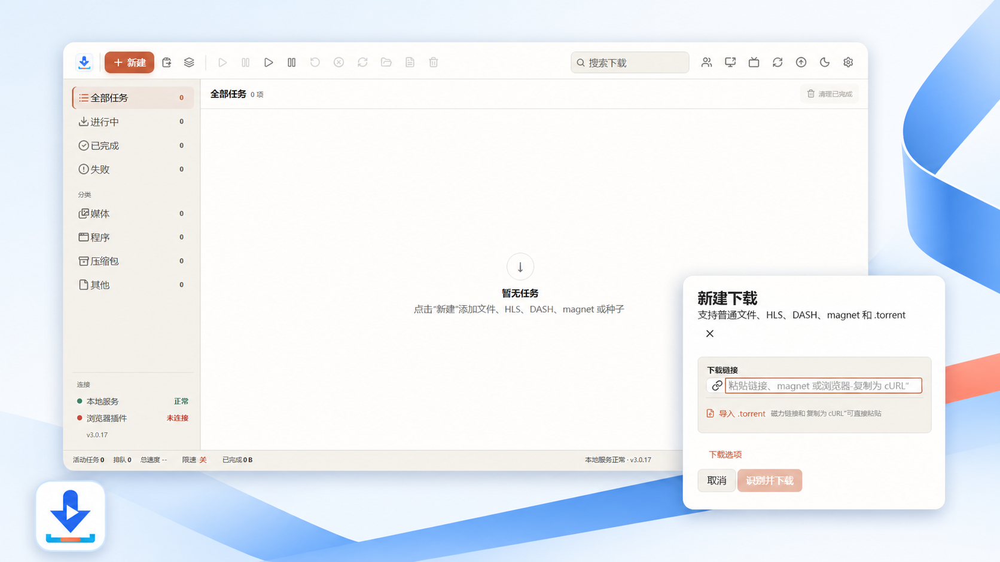
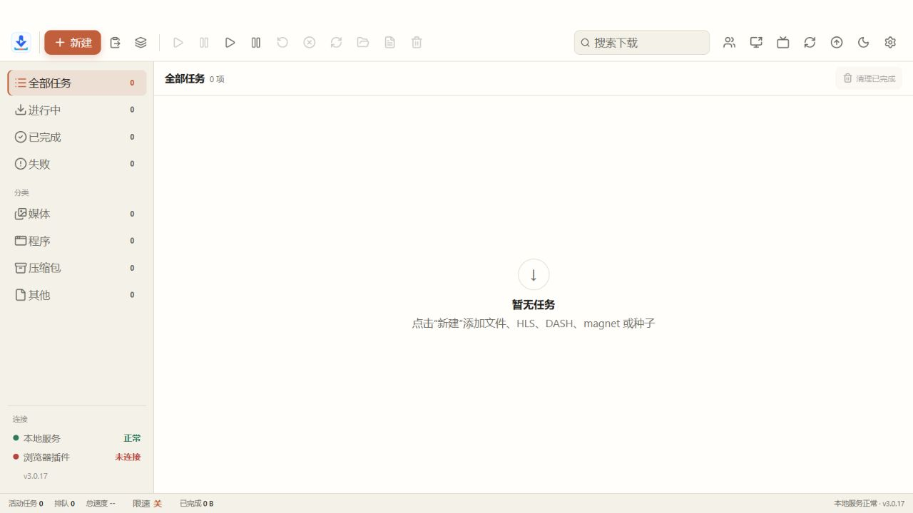
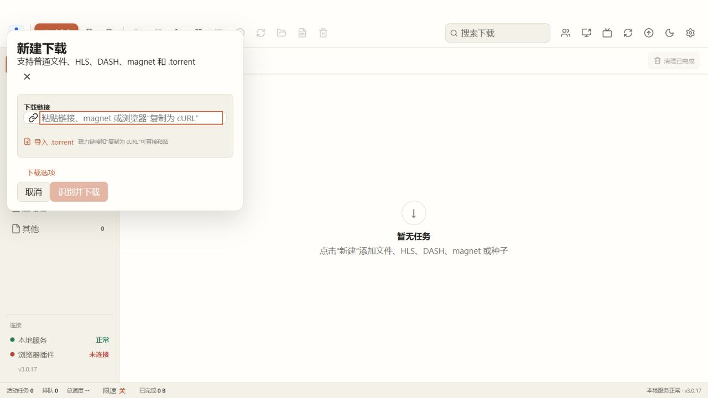
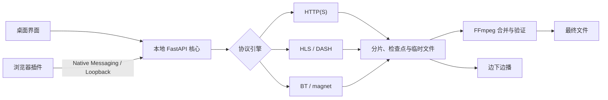

<div align="center">


# HLS Downloader

**一个专注媒体下载、直播录制与浏览器接管的 Windows 本地下载管理器。**

HLS · DASH · HTTP(S) · FTP/FTPS · SFTP · BT / magnet · 边下边播 · 断点续传

[](https://github.com/ciaooo55/hls-downloader/releases/latest)
[](https://github.com/ciaooo55/hls-downloader/actions/workflows/ci.yml)
[](https://github.com/ciaooo55/hls-downloader/actions/workflows/release.yml)
[](https://github.com/ciaooo55/hls-downloader/releases/latest)
[](LICENSE)

[下载最新版](https://github.com/ciaooo55/hls-downloader/releases/latest) · [Firefox 插件](https://addons.mozilla.org/zh-CN/firefox/addon/hls_downloader/) · [快速开始](#-快速开始) · [浏览器插件](#-浏览器插件) · [源码开发](#-源码开发) · [发布说明](docs/releases/v3.0.39.md)

</div>



HLS Downloader 将桌面任务管理、媒体协议解析、直播录制、浏览器下载接管和本地播放器放在一个简洁界面里。程序默认只监听 `127.0.0.1`；任务、配置、缓存和最终文件均保存在本机。

> [!IMPORTANT]
> 本项目不会绕过 DRM、EME 或网站访问控制。首次启动必须阅读并明确同意[《用户协议与免责声明（中国大陆版）》](TERMS.md)和[《隐私政策》](PRIVACY.md)；请只处理你拥有合法下载、录制和传播权利的内容。

## 📦 下载与安装

前往 [GitHub Releases](https://github.com/ciaooo55/hls-downloader/releases/latest) 获取最新版。桌面发布包已经包含下载核心、FFmpeg、ffprobe、播放器资源和 Chromium 插件，不需要另外配置 Python。

| 获取方式 | 适用场景 |
| --- | --- |
| `HLSDownloader-v3.0.39-Windows-x64-Setup.exe` | 推荐；支持开始菜单、卸载入口和应用内更新 |
| `HLSDownloader-v3.0.39-Windows-x64-Portable.zip` | 免安装；完整解压后运行，数据保存在便携目录 |
| `HLSDownloader-v3.0.39-Chrome-Edge-Extension.zip` | Chrome、Edge、Brave、Chromium、Vivaldi、Opera 的 MV3 扩展 |
| [Firefox Add-ons 插件](https://addons.mozilla.org/zh-CN/firefox/addon/hls_downloader/) | Firefox 正式版；安装后由 Firefox 自动更新 |

> [!NOTE]
> 当前安装包没有商业代码签名证书，Windows SmartScreen 首次运行时可能提示“未知发布者”。请只从本仓库 Releases 下载。Git 仓库只保存可继续开发的源码；`release/`、FFmpeg 二进制和构建缓存不提交。

## 🖼️ 界面预览

| 统一任务中心 | 新建下载 |
| --- | --- |
|  |  |

顶部海报使用当前版本的真实界面截图进行产品化构图；上表保留未经改写的原始截图，便于核对实际界面。界面提供任务分类、搜索、批量操作、速度与进度状态、日志、设置、更新入口和浏览器连接状态。关闭主窗口后可继续在系统托盘下载。

## ✨ 核心能力

### ⚡ 稳定下载

- 普通 FTP/FTPS 文件支持单连接下载与 SIZE+REST 断点续传；SFTP 使用单 SSH 会话和 STAT 后续传，未知主机密钥按本机 TOFU 记录；两者都不影响 HTTP Range 路径。
- 资源管理器可对 .url / .magnet 右键“用 HLS Downloader 下载”，不会抢走网页快捷方式的默认打开。监视目录也可导入这些链接文件。
- 可选的下载完成提示音：默认关闭，与系统通知独立；短时间内批量完成会合并为一声。
- 可选的下载完成后病毒扫描：默认关闭，优先 Windows Defender，也可自定义命令；发现威胁不删除文件。
- 普通 HTTP(S) 文件支持严格 Range 分段、字节级断点和源站不支持 Range 时自动单连接回退；可添加备用镜像，身份匹配后故障切换并并行分段。
- 默认每任务 12 路并发，最高 64 路；同时受全局连接预算、单站并发和共享退避限制，避免多个任务把网络打满。
- 支持暂停、恢复、取消、重试、优先级、限速（可分时段）、速度曲线、代理、批量任务（支持从文本/HTML/Metalink 文件导入并导出链接列表）、同名保护和重启恢复；已完成文件被删除后任务会标明“文件已删除”，并可从原地址重新下载。
- 签名 URL 更新后可依据资源标识安全续传；过程文件使用原子写入，跨磁盘完成时安全复制。
- BT / magnet 基于 libtorrent，和 HTTP、HLS、DASH 任务使用同一套任务列表与调度；可监视文件夹自动导入新放入的 .torrent，默认关闭。

### 🎬 媒体与直播

- 解析点播 HLS、LL-HLS 与非 DRM DASH，支持多层主清单、最高质量选择、BYTERANGE、fMP4 init map、AES-128 和 discontinuity。
- 直播录制按分片持久化检查点；独立音视频轨同步录制，停止后由 FFmpeg 无损合并并校验时间轴。
- HLS 点播可保存外挂字幕；完成阶段单独展示合并、转封装和验证进度。
- 达到连续可播放长度后可边下边播；完成后切换到本地 Range 播放，不再读取远端媒体。
- 已完成文件、HTTP/Torrent 连续范围和 HLS/DASH 已下载分片可直接投屏或 TVBox 推送；软件内悬浮窗可暂停、拖动进度并停止共享。设备访问的是受限 LAN 地址，不会重新下载原始 CDN 链接。
- 播放器支持倍速、画中画、全屏、拖动预览和按需缩略图。

### 🧩 浏览器集成

- Chromium 与 Firefox 扩展观察响应、`fetch` / XHR、媒体元素和 Performance 资源，覆盖 iframe 与动态播放器。
- 媒体候选按标签页、页面、frame、播放器和播放时间证据归属；广告、预览流和后台资源会被降权或排除。
- 下载接管以用户下载意图和浏览器真实 `DownloadItem` 为准，保留重定向后的 URL、文件名、类型、大小与必要请求上下文。
- 支持页面悬浮按钮、资源面板、右键下载、magnet、复制为 cURL 和短效链接自动刷新。
- Native Messaging 负责可信配对与冷启动，loopback 通道负责快速通信；核心重启后自动重连，多浏览器和不同插件版本可同时在线。

### 🖥️ Windows 桌面体验

- Tauri 2 原生窗口、系统托盘、单实例唤醒、深浅色主题和剪贴板下载提示。
- 直播或下载期间阻止系统休眠，任务结束后立即恢复原电源策略。
- 安装版支持应用内检查更新、SHA-256 digest 校验、可靠关闭旧实例和覆盖升级。
- 设置、任务历史、缓存与最终文件各自有清晰目录；可按媒体/程序/压缩包/其他自动分类保存，任务里指定的目录不会被改走；卸载时可选择是否保留已下载视频。

### 🔐 本地与安全

- 服务默认仅监听 `127.0.0.1:8765`，浏览器客户端需要配对，网页不能直接调用下载接口。
- Cookie、Authorization 和可重放请求上下文按任务保存时使用 Windows DPAPI 保护。
- 浏览器来源请求会限制本机、内网和链路本地目标；手动桌面任务仍可按用户意图访问 LAN / NAS。
- 日志、请求体、抓取候选和浏览器客户端历史均有容量或生命周期限制。

## 🧭 支持范围

| 类型 | 支持情况 | 说明 |
| --- | :---: | --- |
| HTTP / HTTPS | ✅ | Range 多连接、断点续传、限速、代理、认证请求 |
| 点播 HLS | ✅ | TS / fMP4、AES-128、BYTERANGE、主清单与外挂字幕 |
| 直播 / LL-HLS | ✅ | 持续录制、暂停恢复、独立音视频轨和时间轴修复 |
| 非 DRM DASH | ✅ | 点播与直播；复杂多 Period 清单可使用兼容回退 |
| `.torrent` / magnet | ✅ | libtorrent 下载、恢复与统一调度 |
| 浏览器“复制为 cURL” | ✅ | 导入 URL、请求头、Cookie、Basic Auth 和可安全重放的 POST |
| SAMPLE-AES / DRM / EME | ❌ | 不尝试绕过内容保护 |
| 无法重放的 `blob:` / POST | ❌ | 必须取得真实媒体请求或可重放请求上下文 |

## 🧩 浏览器插件

### Chromium

1. 下载并解压 `HLSDownloader-v3.0.39-Chrome-Edge-Extension.zip`。
2. 打开浏览器扩展管理页并启用“开发者模式”。
3. 选择“加载已解压的扩展程序”，指向解压目录。
4. 启动桌面端；插件会通过 Native Messaging 自动配对，不需要手动复制 Token。

解压加载的扩展不能像商店扩展一样静默在线更新。桌面安装包覆盖升级内置插件后，请在扩展管理页点击“重新加载”。Chrome / Edge 商店版本由商店更新；Windows 上非商店自托管更新通常需要企业策略。

### Firefox

请从 [Firefox Add-ons](https://addons.mozilla.org/zh-CN/firefox/addon/hls_downloader/) 安装官方插件，Firefox 会负责后续更新。插件统一使用 ID `hls-downloader-store@ciaooo55.com`，不再区分网页显示版和网页不显示版。

Cookie 默认不读取，只有用户为具体站点授权后才随该站点媒体请求传给桌面端。按住 `Alt` 点击下载可临时绕过接管。

## 🚀 快速开始

1. 安装桌面版，或完整解压便携版后运行 `HLSDownloader.exe`；首次使用需要阅读并确认用户协议、版权/技术措施和 BT 上传风险。
2. 点击“新建”，粘贴文件、m3u8、MPD、magnet、网页地址或浏览器“复制为 cURL”的内容。
3. 核对识别出的资源、文件名、保存目录和并发数，然后开始下载。
4. 任务可随时暂停、恢复、取消或重试；直播可手动停止或设置录制时长。
5. 媒体积累到可播放长度后点击“边下边播”，完成后直接播放最终本地文件。

安装版数据默认位于 `%LOCALAPPDATA%\HLS Downloader`，视频默认位于 `%USERPROFILE%\Downloads\HLS Downloader`。便携版数据保存在解压目录。缓存目录中的 `.tasks` 保存分片、检查点、BT 数据与日志，暂停或失败任务可能依赖它继续运行。

## 🏗️ 工作方式



桌面端使用 **Tauri 2 + React 19 + TypeScript**，下载核心使用 **Python 3.12 + FastAPI**，浏览器扩展使用 **WXT + Manifest V3**。更多设计细节见 [架构说明](docs/architecture.md)、[设计文档](DESIGN.md) 和 [成熟下载器对照审计](docs/mature-download-manager-audit.md)。

## 🛠️ 源码开发

### 环境要求

- Windows 10/11 x64
- Python 3.12
- Node.js 24 与 pnpm 11
- Rust stable（构建 Tauri 桌面端）
- FFmpeg 与 ffprobe（开发运行时放入 `bin/`）

### 安装与运行

```powershell
python -m pip install -r requirements-dev.txt

cd frontend
corepack enable
corepack prepare pnpm@11.7.0 --activate
pnpm install --frozen-lockfile
cd ..

.\build_frontend.ps1
.\run_backend.ps1
```

打开 `http://127.0.0.1:8765/ui`。前端热更新可运行 `.\run_frontend.ps1`。

构建浏览器扩展：

```powershell
cd extension
corepack enable
corepack prepare pnpm@11.7.0 --activate
pnpm install --frozen-lockfile
pnpm run build
```

### 测试

```powershell
python -m pytest -q
python -m ruff check backend tests
python -m mypy backend

cd frontend
pnpm test
pnpm run build
pnpm run tauri:build
```

扩展测试在 `extension/` 运行 `pnpm test`。真实下载、浏览器接管、安装升级、系统托盘和休眠抑制还应按 `scripts/smoke_*.py`、`scripts/smoke-*.ps1` 做针对性冒烟。

## 📦 打包与发布

本地打包需要 PyInstaller、NSIS、FFmpeg 和 ffprobe：

```powershell
python -m pip install -r requirements-build.txt
.\scripts\build_installer.ps1 -Version 3.0.39
```

输出位于被 Git 忽略的 `release/`：

```text
HLSDownloader-v3.0.39-Windows-x64-Setup.exe
HLSDownloader-v3.0.39-Windows-x64-Portable.zip
```

需要构建浏览器插件时，本地打包追加 `-IncludeExtensionAssets`，或在 GitHub Actions 手动运行时勾选 `include_extensions`。

- 推送到 `main` 或提交 Pull Request：运行后端、前端和扩展测试与构建。
- 手动运行 [Windows Release](https://github.com/ciaooo55/hls-downloader/actions/workflows/release.yml)：生成工作流产物，不创建正式 Release。
- 推送 `v*` 标签：测试、打包并创建 GitHub Release；只有相对上一标签检测到 `extension/` 变化时才附带插件资产。

```powershell
git tag v3.0.39
git push origin v3.0.39
```

完整流程和 PowerShell 5.1 / 7 编码要求见 [发布文档](docs/releasing.md)。

## 🗂️ 项目结构

```text
backend/       FastAPI、统一任务调度、下载核心与 Native Host
extension/     WXT/React Chromium 与 Firefox MV3 扩展
frontend/      React/TypeScript + Tauri 桌面界面与播放器
installer/     NSIS 安装与覆盖升级脚本
scripts/       构建、发布和真实环境 smoke
tests/         Python 自动化测试
.github/       CI 与 GitHub Release 工作流
```

默认配置模板是 [`config.default.json`](config.default.json)。不要提交个人 `config.json`、Cookie、代理凭据、下载记录、数据库、日志或构建产物。

## 🔐 安全与隐私

安全问题请参阅 [SECURITY.md](SECURITY.md)，数据使用说明见 [PRIVACY.md](PRIVACY.md)，第三方组件许可见 [THIRD_PARTY_NOTICES.md](THIRD_PARTY_NOTICES.md)。

- 首次启动采用版本化法律确认：阅读完整用户协议与隐私政策并明确同意后，下载与投屏功能才会启用；不同意会直接退出软件。
- 本机仅记录协议版本、协议/隐私正文 SHA-256 摘要和 UTC 接受时间；正文发生变化会自动要求重新确认。
- 未确认时，后端同样拒绝创建、恢复、浏览器接管、BT 和投屏请求，不能仅绕过前端弹窗继续传输。
- BT/magnet 下载期间会向其他 Peer 上传分片；只有同时具有下载和传播权限时才应使用。
- 不要将本地服务监听地址改为公网地址。
- 不要共享含 Cookie、Authorization、代理密码或短效签名 URL 的日志与配置。
- Native Messaging 注册会修改当前用户的浏览器 Native Host 配置。
- 下载、录制或投屏前，请确认你拥有相应内容的访问和保存权利。
- 二次开发与再分发必须保留 MIT 许可，并单独履行 FFmpeg 及其他第三方组件的许可证、通知、源码提供和构建信息义务；原项目协议不能替修改版承担合规责任。

## 📄 License

[MIT License](LICENSE)
