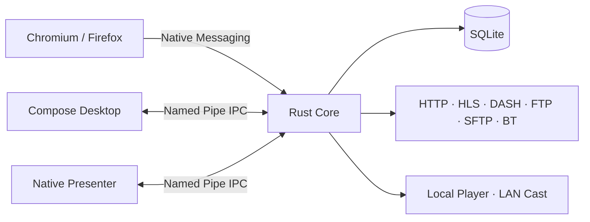

<div align="center">
  

  <h1>HLS Downloader</h1>

  <p><strong>不只是 m3u8 下载器，而是一套面向 Windows 的现代下载工作台。</strong></p>
  <p>普通文件 · HLS · DASH · FTP · SFTP · BitTorrent · 浏览器接管 · 断点续传 · 本地播放 · 局域网投屏</p>

  <p>
    <strong>简体中文</strong> · <a href="README_EN.md">English</a>
  </p>

  <p>
    <a href="https://github.com/ciaooo55/hls-downloader/releases"></a>
    <a href="https://github.com/ciaooo55/hls-downloader/actions/workflows/ci.yml"></a>
    <a href="LICENSE"></a>
    
    
  </p>
</div>

---

HLS Downloader 是一款面向 Windows 的桌面下载管理器。它把普通文件下载、HLS/DASH 流媒体、FTP/SFTP、BitTorrent，以及浏览器里的下载接管统一放进一个可恢复、可追踪的任务队列里。

它和普通“关掉窗口就结束”的下载器不太一样：真正的下载任务由独立的 **Rust Core** 持有，桌面工作台、浏览器扩展和原生提示窗口只是客户端。即使关闭主窗口、浏览器或播放器，正在运行的任务也不会因为 UI 消失而一起终止。

## 🚀 下载

推荐直接从 **GitHub Releases** 获取构建好的 Windows 版本：

[](https://github.com/ciaooo55/hls-downloader/releases)

发布包可包含 Windows x64 的 **EXE / MSI / Portable ZIP**，以及配套的 **Chromium / Firefox 浏览器扩展**。

> [!NOTE]
> 当前 `main` 是 **7.0.2** 源码开发线。公开安装包以 Releases 页面为准；带 `candidate` / `pre-release` 标记的版本应按测试版使用。

## ✨ 为什么用它

| | |
| --- | --- |
| ⚡ **可靠续传**<br>支持长时间任务、断点恢复、失败重试、请求恢复与任务状态持久化。 | 🎬 **HLS / DASH 下载**<br>支持 HLS 与 DASH，覆盖点播和直播工作流，并能处理需要请求上下文的媒体任务。 |
| 🌐 **浏览器接管**<br>Chromium 与 Firefox Manifest V3 扩展可识别下载和媒体资源，并通过 Native Messaging 交给桌面端。 | 🧠 **独立 Rust Core**<br>Core 独立持有下载状态与 SQLite；主界面、浏览器或播放器关闭后，活动传输仍可继续。 |
| 📦 **多协议统一管理**<br>HTTP/HTTPS、FTP、SFTP、BitTorrent 与流媒体任务都进入同一套队列和控制逻辑。 | 🧩 **桌面工作台**<br>支持新建任务、粘贴/拖放、批量导入、暂停/恢复/重试、任务详情、日志、速度与连接状态查看。 |
| 📺 **播放与投屏**<br>下载后的媒体可本地播放，也可通过局域网发布到兼容设备 / TVBox 场景。 | 🛟 **升级与回滚**<br>安装与更新流程包含校验、Native Messaging Host 注册和回滚路径，降低升级失败带来的影响。 |

## 🔌 支持范围

| 类型 | 支持 | 说明 |
| --- | :---: | --- |
| HTTP / HTTPS | ✅ | 普通文件下载、恢复、任务级请求上下文 |
| HLS / `.m3u8` | ✅ | VOD / Live |
| DASH / `.mpd` | ✅ | 流媒体下载 |
| FTP | ✅ | 文件传输 |
| SFTP | ✅ | SSH 文件传输 |
| BitTorrent / Magnet | ✅ | BT 任务与磁力链接工作流 |
| Chromium 扩展 | ✅ | Manifest V3 + Native Messaging |
| Firefox 扩展 | ✅ | Manifest V3 + Native Messaging |
| 本地播放 | ✅ | 打包版本使用内置媒体播放链路 |
| 局域网投屏 | ✅ | LAN 发布 / 设备选择 / TVBox 工作流 |

## 🧭 三步开始

1. 从 [Releases](https://github.com/ciaooo55/hls-downloader/releases) 下载并安装桌面端；需要浏览器接管时，同时使用对应的 Chromium / Firefox 扩展。
2. 在桌面端直接粘贴链接、拖放内容、新建/批量导入任务，或者让浏览器扩展把识别到的下载与媒体资源交给 HLS Downloader。
3. 在工作台里管理暂停、恢复、重试、日志和播放。下载由 Core 持续持有，因此你不需要为了让任务继续而一直开着主界面。

## 🌐 浏览器接管是怎么工作的

浏览器扩展并不自己执行下载。它负责识别资源、收集完成任务所需的请求信息，然后通过 Native Messaging 把任务交给本机 Core。

这意味着浏览器只是入口，而不是下载生命周期的所有者：浏览器崩溃、关闭或扩展重新连接时，已经进入 Core 的任务仍由桌面端自己的持久状态管理。

## 🏗️ 架构



核心原则很简单：**只有 Core 拥有下载状态和 SQLite**。Compose Desktop、浏览器扩展、Presenter、播放器和投屏链路都围绕同一个 Core 协作，不再各自维护第二套下载状态。

## 📁 项目结构

| 目录 | 作用 |
| --- | --- |
| `native_shell/` | Rust Core、SQLite、传输引擎、Native Messaging Host、更新器 |
| `desktop_ui/` | Kotlin / Compose Desktop 主工作台 |
| `presenter_ui/` | 低延迟的原生确认、进度与完成窗口 |
| `extension/` | WXT 构建的 Chromium / Firefox Manifest V3 扩展 |
| `scripts/` | Windows 构建、测试、安装、升级、打包与验证脚本 |
| `docs/` | v7 架构、模块图、验证记录、升级说明与源码历史 |

## 🛠️ 从源码构建

项目优先面向 Windows。首次开发时，可从仓库根目录引导固定版本的工具链：

```powershell
powershell.exe -NoProfile -ExecutionPolicy Bypass -File .\scripts\bootstrap-v7-toolchain.ps1
```

运行集成测试：

```powershell
.\scripts\build-v7.ps1 -Task test
```

也可以分别测试各组件：

```powershell
# Rust Core
cargo test --manifest-path native_shell/Cargo.toml --lib

# Native Presenter
cargo test --manifest-path presenter_ui/Cargo.toml

# Compose Desktop
cd desktop_ui
.\gradlew.bat test --no-daemon

# Browser Extension
cd ..\extension
pnpm install --frozen-lockfile
pnpm test
pnpm run build
```

更完整的实现与验证细节见：

- [v7 架构](docs/v7-architecture.md)
- [v7 模块与功能衔接](docs/v7-module-map.md)
- [v7 验证状态](docs/v7-verification.md)
- [本地升级与回滚](docs/v7-local-upgrade.md)
- [源码布局与历史版本](docs/source-layout-and-history.md)

## 🧬 一个仓库，多代实现

当前 `main` 保留完整的 v7 源码；v3、v5、v6 的历史实现保留在 Git tags 中，而不是复制成多个互相漂移的项目。

```powershell
git show v3.0.39:frontend/package.json
git show v5.0.13:backend/app/main.py
git show v6.0.1:native_ui/Cargo.toml
```

## 🔐 安全、隐私与合法使用

请只下载你有权访问、保存或处理的内容，并遵守所在地区的法律、网站条款和内容许可。

项目相关文档： [LICENSE](LICENSE) · [SECURITY](SECURITY.md) · [PRIVACY](PRIVACY.md) · [TERMS](TERMS.md) · [Third-party notices](THIRD_PARTY_NOTICES.md)

## ⭐ 喜欢这个项目？

如果 HLS Downloader 对你有帮助，欢迎点一个 **Star**。Bug、兼容性问题和功能建议也可以直接在 [Issues](https://github.com/ciaooo55/hls-downloader/issues) 里反馈。

<div align="center">
  <sub>Built for long-running downloads, browser handoff and resilient media workflows on Windows.</sub>
</div>
