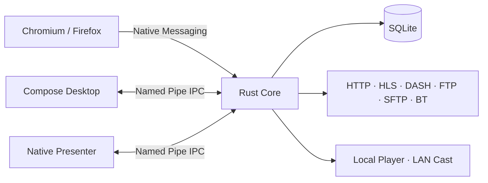

<div align="center">
  

  <h1>HLS Downloader</h1>

  <p><strong>More than an m3u8 downloader — a modern Windows download workbench.</strong></p>
  <p>Files · HLS · DASH · FTP · SFTP · BitTorrent · Browser handoff · Resume · Local playback · LAN casting</p>

  <p>
    <a href="README.md">简体中文</a> · <strong>English</strong>
  </p>

  <p>
    <a href="https://github.com/ciaooo55/hls-downloader/releases"></a>
    <a href="https://github.com/ciaooo55/hls-downloader/actions/workflows/ci.yml"></a>
    <a href="LICENSE"></a>
    
    
  </p>
</div>

---

HLS Downloader is a Windows-first desktop download manager that brings ordinary file downloads, HLS/DASH streaming media, FTP/SFTP, BitTorrent, and browser download handoff into one recoverable, persistent task queue.

Unlike downloaders whose transfer lifetime is tied to the visible window, HLS Downloader keeps active jobs inside an independent **Rust Core**. The desktop workbench, browser extension, and native presenter are clients of that Core, so closing the main window, browser, or player does not automatically terminate active transfers.

## 🚀 Download

The recommended way to get HLS Downloader is from **GitHub Releases**:

[](https://github.com/ciaooo55/hls-downloader/releases)

Release bundles may include Windows x64 **EXE / MSI / Portable ZIP** packages together with matching **Chromium / Firefox browser extensions**.

> [!NOTE]
> `main` currently tracks the **7.0.2** source line. Public installers are published through Releases; builds marked `candidate` or `pre-release` should be treated as test builds.

## ✨ Why HLS Downloader

| | |
| --- | --- |
| ⚡ **Resilient transfers**<br>Designed for long-running jobs with resume, retry, request recovery, and persistent task state. | 🎬 **HLS / DASH media**<br>Supports HLS and DASH for both VOD and live workflows, including media jobs that require request context. |
| 🌐 **Browser handoff**<br>Chromium and Firefox Manifest V3 extensions can discover downloads and media resources, then hand them to the desktop app through Native Messaging. | 🧠 **Independent Rust Core**<br>The Core owns transfer state and SQLite, so active downloads can continue even when the workbench, browser, or player is closed. |
| 📦 **One queue, multiple protocols**<br>HTTP/HTTPS, FTP, SFTP, BitTorrent, and streaming media share one task model and control path. | 🧩 **Desktop workbench**<br>Create tasks, paste or drop links, batch import, pause/resume/retry, inspect logs, speed, details, and connection state. |
| 📺 **Playback and casting**<br>Play downloaded media locally or publish it over the LAN for compatible devices / TVBox-style workflows. | 🛟 **Upgrade and rollback path**<br>Packaging and install flows include validation, Native Messaging Host registration, and rollback handling. |

## 🔌 Supported workflows

| Type | Support | Notes |
| --- | :---: | --- |
| HTTP / HTTPS | ✅ | Regular downloads, recovery, per-task request context |
| HLS / `.m3u8` | ✅ | VOD / Live |
| DASH / `.mpd` | ✅ | Streaming media downloads |
| FTP | ✅ | File transfer |
| SFTP | ✅ | SSH file transfer |
| BitTorrent / Magnet | ✅ | BT tasks and magnet-link workflows |
| Chromium extension | ✅ | Manifest V3 + Native Messaging |
| Firefox extension | ✅ | Manifest V3 + Native Messaging |
| Local playback | ✅ | Bundled media playback path in packaged builds |
| LAN casting | ✅ | LAN publishing / device selection / TVBox workflow |

## 🧭 Get started in three steps

1. Download and install the desktop app from [Releases](https://github.com/ciaooo55/hls-downloader/releases). If you want browser handoff, use the matching Chromium or Firefox extension as well.
2. Paste a URL, drop content into the workbench, create or batch-import tasks, or let the browser extension send discovered downloads and media resources to HLS Downloader.
3. Manage pause, resume, retry, logs, details, and playback from the workbench. The Core owns the download lifetime, so the main UI does not need to remain open for active jobs to exist.

## 🌐 How browser handoff works

The extension does not perform the transfer itself. It discovers resources, gathers the request information needed to reproduce the task, and sends the handoff to the local Core through Native Messaging.

That keeps the browser as an entry point rather than the owner of the download lifecycle. Once a task has entered the Core, its persistent state is managed independently of the browser connection.

## 🏗️ Architecture



The architectural rule is intentionally simple: **the Core is the only owner of download state and SQLite**. Compose Desktop, the browser extension, presenter, player, and casting path all cooperate with the same Core instead of maintaining competing copies of task state.

## 📁 Repository layout

| Path | Responsibility |
| --- | --- |
| `native_shell/` | Rust Core, SQLite, transfer engines, Native Messaging Host, updater |
| `desktop_ui/` | Kotlin / Compose Desktop main workbench |
| `presenter_ui/` | Low-latency native confirmation, progress, and completion windows |
| `extension/` | WXT-based Chromium / Firefox Manifest V3 extension |
| `scripts/` | Windows build, test, install, upgrade, package, and verification scripts |
| `docs/` | v7 architecture, module map, verification, upgrade notes, and source history |

## 🛠️ Build from source

The active product line is Windows-first. On a clean development machine, bootstrap the pinned toolchain from the repository root:

```powershell
powershell.exe -NoProfile -ExecutionPolicy Bypass -File .\scripts\bootstrap-v7-toolchain.ps1
```

Run the integrated test gate:

```powershell
.\scripts\build-v7.ps1 -Task test
```

Or test individual components:

```powershell
# Rust Core
cargo test --manifest-path native_shell/Cargo.toml --lib

# Native Presenter
cargo test --manifest-path presenter_ui/Cargo.toml

# Compose Desktop
cd desktop_ui
.\gradlew.bat test --no-daemon

# Browser Extension
cd ..\extension
pnpm install --frozen-lockfile
pnpm test
pnpm run build
```

For deeper implementation and verification details, see:

- [v7 architecture](docs/v7-architecture.md)
- [v7 module map](docs/v7-module-map.md)
- [v7 verification status](docs/v7-verification.md)
- [Local upgrade and rollback](docs/v7-local-upgrade.md)
- [Source layout and version history](docs/source-layout-and-history.md)

## 🧬 One repository, multiple generations

The complete active v7 source lives on `main`. Historical v3, v5, and v6 implementations remain available through Git tags instead of being copied into separate drifting repositories.

```powershell
git show v3.0.39:frontend/package.json
git show v5.0.13:backend/app/main.py
git show v6.0.1:native_ui/Cargo.toml
```

## 🔐 Security, privacy, and lawful use

Only download content that you are authorized to access, store, or process. Follow applicable laws, website terms, and content licenses in your jurisdiction.

Project documents: [LICENSE](LICENSE) · [SECURITY](SECURITY.md) · [PRIVACY](PRIVACY.md) · [TERMS](TERMS.md) · [Third-party notices](THIRD_PARTY_NOTICES.md)

## ⭐ Like the project?

If HLS Downloader is useful to you, consider giving the repository a **Star**. Bugs, compatibility problems, and feature requests are welcome in [Issues](https://github.com/ciaooo55/hls-downloader/issues).

<div align="center">
  <sub>Built for long-running downloads, browser handoff and resilient media workflows on Windows.</sub>
</div>
